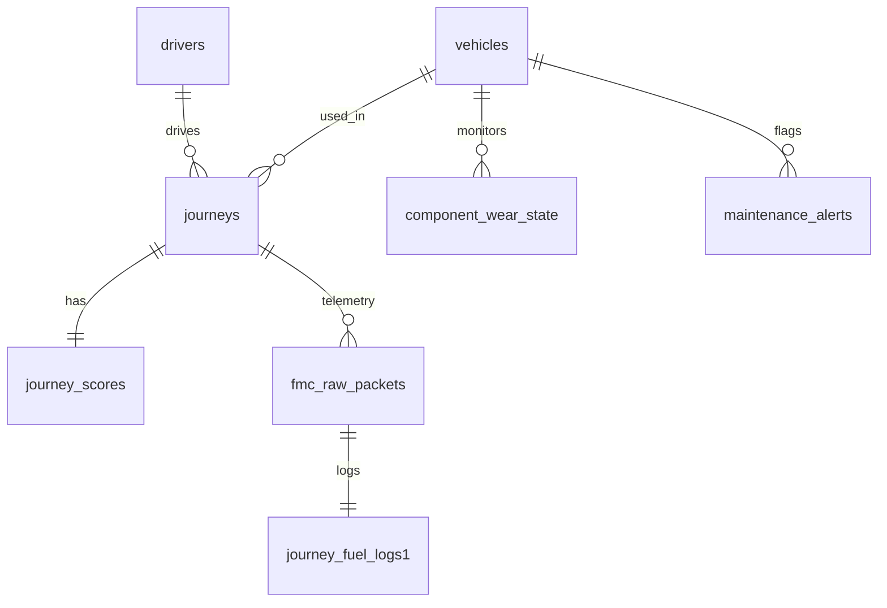
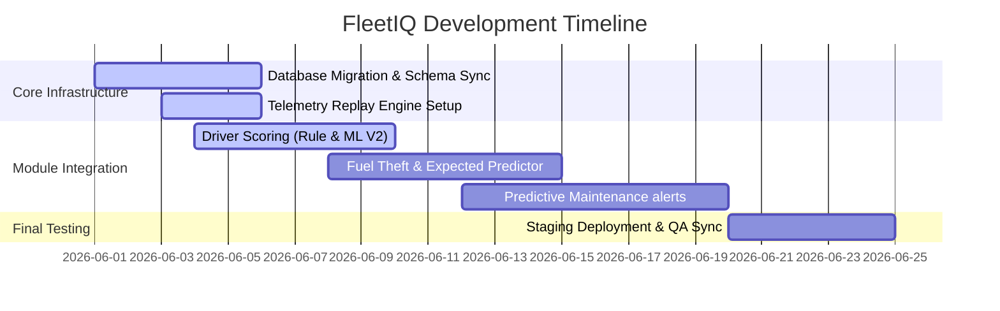

# 🌐 NAVI-GATTO / FLEETIQ — PROJECT IMPLEMENTATION PLAN & SYSTEM ARCHITECTURE

This document serves as the official **Project Implementation Plan and System Architecture Specification** for the **FleetIQ / Navi-Gatto** platform. It outlines the architecture, database schema, module integrations, algorithm designs (Rule-Based and Machine Learning), Git strategy, and runtime environment settings.

---

## 1. Executive Summary & Project Overview

**FleetIQ (Navi-Gatto)** is an intelligent, full-stack fleet telemetry, driver safety scoring, fuel theft monitoring, and predictive vehicle maintenance platform. By integrating raw telematics data from vehicle GPS and OBD-II systems, FleetIQ translates complex raw variables into actionable insights.

The platform focuses on three main pillars:
1. **Driver Behaviour & Safety Scoring**: Dual-engine performance grading (Rule-Based and context-aware Machine Learning) to reduce risk, lower insurance costs, and highlight driver coaching opportunities.
2. **Fuel Analytics & Theft Detection**: Continuous tracking of actual vs. expected fuel usage combined with real-time detection of fuel theft events (siphoning/pilferage).
3. **Predictive Vehicle Maintenance**: Multi-component wear tracking (tires, brakes, clutch, battery, engine) using kinematic physics and sensor thresholds to generate proactive, pre-failure alert logs.

---
2
### 2.1 Frontend Architecture
*   **Framework**: React (using Vite as a fast builder/bundler).
*   **Styling**: Tailwind CSS (fully responsive sidebar, cards, and grid system).
*   **Data Visualization**: Recharts (dynamic, interactive charts showing speed profiles, fuel logs, and telemetry comparisons).
*   **Icons**: Lucide React.
*   **Integration**: Seamless connection to the FastAPI backend using standard `fetch`/`Axios` hooks.

### 2.2 Backend Architecture
*   **Web Framework**: FastAPI (high-performance asynchronous Python web server).
*   **ORM**: SQLAlchemy (object-relational mapping to clean DB schema models).
*   **Development Server**: Uvicorn (mounted with hot-reload features).
*   **Background Threads**: Utilizes python native asynchronous loops and background execution for real-time telemetry replay engines.

### 2.3 Database Engine Compatibility
*   **SQL Server (SSMS)**: Supports Windows Authentication and SQL Server Authentication using ODBC Driver 17. Facilitates live telemetry replay using stored procedures.
*   **SQLite**: Full local offline fallback support utilizing SQLite (`navigatto.db`) to enable quick demoing and unit testing without active SQL Server installations.

---

## 3. Module Architecture & Technical Details

### 3.1 Driver Behaviour & Safety Scoring Module
The Driver Module evaluates driver performance and grades their safety score out of 100 using two distinct methods:

#### A. Rule-Based Scoring (`scorer.py`)
Mimics established telematics protocols (such as Geotab) using mathematical normalization:
1.  **Deductions per Kilometer**: Event counts (harsh acceleration, harsh braking, speeding, and harsh cornering) are normalized over **1,000 kilometers**:
    $$\text{Component Score} = 100 - \frac{\text{event\_count} \times 1000}{\text{distance\_km}}$$
2.  **Engine Idling Deductions**: Evaluates the ratio of idling duration to overall trip time:
    $$\text{Idle Percentage} = \frac{\text{idle\_time\_min}}{\text{trip\_duration\_min}}$$
    $$\text{Component Score} = 100 - (\text{Idle Percentage} \times 100)$$
3.  **Weighted Aggregation**:
    *   Harsh Braking Penalty Weight: **30%**
    *   Speeding Penalty Weight: **30%**
    *   Harsh Acceleration Weight: **20%**
    *   Harsh Cornering Weight: **10%**
    *   Idle Time Weight: **10%**
4.  **Risk Tiers**:
    *   `Low Risk`: 80 to 100
    *   `Mild Risk`: 60 to 79
    *   `Poor Classification`: 40 to 59
    *   `High Risk`: 0 to 39

#### B. Machine Learning Scoring (`ml_scorer.py` & `ml_trainer.py`)
Predicts performance contextually using an XGBoost model:
*   **Model Versioning**: Evaluates configuration variables (e.g. `USE_ML_MODEL=2` for the 19-feature context-aware model).
*   **Context-Aware Multipliers**: Multiplies base rule penalties dynamically based on geographical conditions during training label generation:
    *   *Highway*: 1.20 (Strict - high speed risks)
    *   *Mountain*: 1.30 (Strict - steep slopes, curves)
    *   *City*: 0.85 (Lenient - frequent stop/starts allowed)
    *   *Rural*: 1.00
    *   *Mixed*: 1.10
*   **Derived Ratio Features**: Injects 7 derived ratios (e.g., `accel_per_km`, `rpm_per_speed`, `idle_pct`) to give the ML estimator a deeper representation of driving style.
*   **Confidence Level Metric**: Evaluates Euclidean distance from the training distribution origin:
    $$\text{Confidence} = 100 \times e^{-0.05 \times \text{distance}}$$
*   **Proportional Back-Distribution**: Converts the predicted model output (single value) back into standard categories (speeding, braking, etc.) proportionally based on the baseline rule deductions.
*   **Reliability Fallback**: If models cannot be parsed or fail to load, the system falls back to the deterministic rule-based scorer automatically.

---

### 3.2 Fuel Analytics & Theft Detection Module
Tracks and protects fleet fuel usage.

*   **Data Aggregation**: Receives packets from FMC telematics devices recording GPS coordinates, speed, and fuel level in liters (`dbo.fmc_raw_packets`).
*   **Fuel Theft Algorithm**:
    *   Computes fuel difference over intervals.
    *   Identifies sudden drops when ignition is OFF (indicating siphoning) or drops exceeding normal thresholds while ignition is ON.
    *   Classifies and tags events as `is_fuel_theft` and logs the theft volume (`theft_amount_liters`) and type (`dbo.journey_fuel_logs1`).
*   **Fuel Consumption Predictor (`predictor.py`)**: Uses an XGBoost model (`xgboost_fuel_prediction_model.pkl`) to calculate expected fuel consumption based on payload, speed profiles, routing, and idling duration. A significant variance indicates fuel theft or engine inefficiency.

---

### 3.3 Predictive Vehicle Maintenance Module
Monitors vehicle component health and alerts fleet dispatchers before catastrophic failure occurs.

*   **Component Lifespan Tracking**: Monitors 5 key systems:
    1.  *Brakes*: Wear accumulated dynamically based on speed, gross vehicle weight (GVW), slope, and lateral acceleration.
    2.  *Clutch*: Wear calculated from torque, RPM, speed, and slip ratios.
    3.  *Tires*: Wear simulated using distance, lateral Gs, vibration, and temperature metrics.
    4.  *Battery*: Monitored via nominal voltage, voltage under load, and state-of-health percentage.
    5.  *Engine*: Monitored using oil pressure, coolant temperature, engine load, and over-revolution counts.
*   **Rule Engine**: Generates warnings and critical flags whenever the calculated Remaining Useful Life (RUL) drops below defined thresholds.
*   **Wear DB Update**: Computes live wear rates and updates the `dbo.component_wear_state` table.

---

## 4. Relational Database Schema & Entities

The database (mapped using SQLAlchemy declarative base) utilizes the schema `"dbo"` and contains the following central models:



### 4.1 Master Entities
1.  **Driver (`dbo.drivers`)**
    *   `driver_id` (String, PK) - Unique identification code.
    *   `driver_name` (String) - Full name.
    *   `is_active` (Boolean) - Operational status.
2.  **Vehicle (`dbo.vehicles`)**
    *   `id` (String, PK) - Registry plate or identifier.
    *   `vehicle_name` (String) - Name.
    *   `vehicle_type` (String) - Classification (e.g., Heavy Duty Truck, Light Commercial).
    *   `is_active` (Boolean) - Operations status.

### 4.2 Telemetry & Processed Scoring
3.  **Trip / Journey (`dbo.journeys`)**
    *   `trip_id` (String, PK) - Unique journey identifier.
    *   `vehicle_id` (String, FK)
    *   `driver_id` (String, FK)
    *   `route_type` (String) - Highway, City, Mountain, Rural, Mixed.
    *   `distance_km` (Float) - Total odometer difference.
    *   `trip_duration_min` (Float) - Duration in minutes.
    *   `accel_events` / `brake_events` / `over_speed_count` / `cornering_events` (Integer) - Aggregated counts.
    *   `idle_time_min` (Float) - Total stationary time with engine active.
    *   `avg_engine_rpm` (Float) - Engine speed.
4.  **JourneyScore (`dbo.journey_scores`)**
    *   `trip_id` (String, PK, FK to journeys)
    *   `driver_score` (Float) - Calculated safety index.
    *   `actual_fuel_used_L` (Float) - Consumed fuel volume.
    *   `expected_fuel_L` (Float) - Predicted fuel baseline.
    *   `theft_occurred` (String) / `theft_type` (String) / `theft_amount_L` (Float) - Fuel security indicators.

### 4.3 Fuel Logging
5.  **FmcRawPacket (`dbo.fmc_raw_packets`)**
    *   `id` (Integer, PK)
    *   `trip_id` (String, FK)
    *   `ignition` (Boolean)
    *   `speed_kmh` (Float)
    *   `fuel_level_liters` (Float)
6.  **JourneyFuelLog1 (`dbo.journey_fuel_logs1`)**
    *   `id` (Integer, PK)
    *   `raw_packet_id` (Integer, FK)
    *   `fuel_diff_liters` (Float)
    *   `is_fuel_theft` (Boolean) - Theft flag.
    *   `theft_amount_liters` (Float) - Theft volume.

### 4.4 Maintenance Logs
7.  **ComponentWearState (`dbo.component_wear_state`)**
    *   `id` (String, PK)
    *   `vehicle_id` (String, FK)
    *   `component` (String) - Brakes, Tire, Clutch, Battery, Engine.
    *   `accumulated_wear` (Numeric) - Accumulated wear metrics.
    *   `rul` (Numeric) - Remaining Useful Life (RUL).
    *   `health_score` (Numeric) - Computed 0–100 health score.
8.  **MaintenanceAlert (`dbo.maintenance_alerts`)**
    *   `id` (String, PK)
    *   `vehicle_id` (String, FK)
    *   `component` (String)
    *   `alert_level` (String) - warning | critical | urgent.
    *   `message` (String) - Technical description.
    *   `acknowledged` (Boolean) - Log acknowledgment.

---

## 5. Git Branching & Collaboration Strategy

To ensure seamless coordination across a 3-person engineering team working on different components of the same repository, FleetIQ implements the branching model detailed in [GIT_STRATEGY.md](file:///d:/Desktop/Navigatto_modules/GIT_STRATEGY.md):

*   **Branch Architecture**:
    *   `main`: Holds only stable, production-ready, and demo-tested releases.
    *   `dev`: The core integration and staging branch. All features merge here first.
    *   `feature/driver-module`: Assigned to Person 1 (Harsh) for Driver Behavior.
    *   `feature/fuel-module`: Assigned to Person 2 for Fuel Tracking & Theft Detection.
    *   `feature/maintenance-module`: Assigned to Person 3 for Maintenance Alerts.
*   **Daily Sync Workflow**:
    1.  Fetch latest changes: `git fetch origin`
    2.  Merge dev updates into feature branch: `git merge origin/dev`
    3.  Develop, commit using structured prefixes: `feat(driver):`, `fix(fuel):`, `docs:`
    4.  Push changes and create a Pull Request to `dev` for peer review.
    5.  Once all modules are verified on `dev`, merge `dev` into `main`.

---

## 6. Execution & Setup Instructions

### 6.1 Prerequisites
*   **Backend**: Python 3.9+ with packages configured in [requirements.txt](file:///d:/Desktop/Navigatto_modules/project/requirements.txt) (`fastapi`, `uvicorn`, `sqlalchemy`, `pyodbc`, `xgboost`, `scikit-learn`, etc.).
*   **Frontend**: Node.js 18+ and `npm`.

### 6.2 Environment Configuration
Create a `.env` file in the project root directory (using [.env.example](file:///d:/Desktop/Navigatto_modules/.env.example) as reference):
```ini
DB_TYPE=sqlite                     # sqlite OR mssql
DB_HOST=localhost                  # SQL Server host (if mssql)
DB_NAME=driver                     # Database name (if mssql)
DB_TRUSTED_CONNECTION=yes          # yes for Windows Auth, no for SQL Server Auth
DB_USER=                           # SQL Server username (if trusted=no)
DB_PASSWORD=                       # SQL Server password (if trusted=no)
USE_ML_MODEL=2                     # Toggles ML Scorer Model Version (1 or 2)
TELEMETRY_REPLAY_INTERVAL_SEC=30   # Time interval for live replay simulation
ENABLE_MANUAL_REPLAY_CONTROL=false # Toggle manual control over replay loop in UI
```

### 6.3 Running the Application Locally
Launch backend and frontend concurrently using the execution script:
```bash
python run_app.py
```
This runs:
*   **Frontend**: Vite Dev Server on `http://localhost:5173`
*   **Backend**: Uvicorn API on `http://localhost:8000`

---

## 7. Roadmap & Integration Timeline



1.  **Phase 1: DB & Replay Engine Alignment** (Current):
    Setup SQLite and SQL Server support. Configure the `ReplayManager` background loop.
2.  **Phase 2: Context-Aware Driver Scoring Integration**:
    Validate XGBoost ML V2 (19 features) containing proportional penalty distributions and confidence values.
3.  **Phase 3: Fuel Analytics Integration**:
    Uncomment fuel routers in `main.py` and connect expected consumption predictions.
4.  **Phase 4: Maintenance Engine Activation**:
    Integrate simulated wear events into front-end charts and test diagnostic alerts.
5.  **Phase 5: Full QA & Staging Build**:
    Run integration tests on a staging environment and prepare the final demo for clients.
